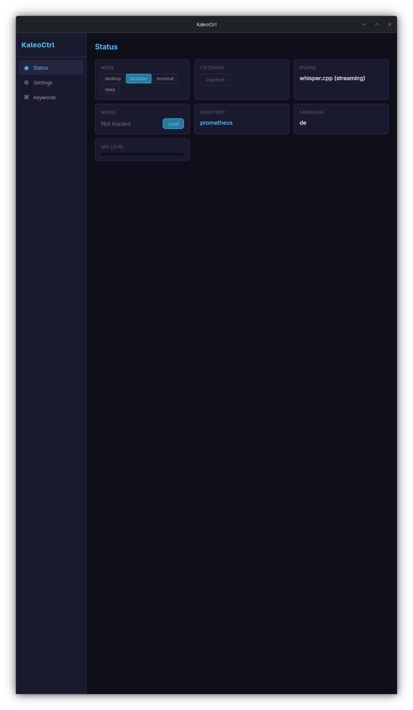
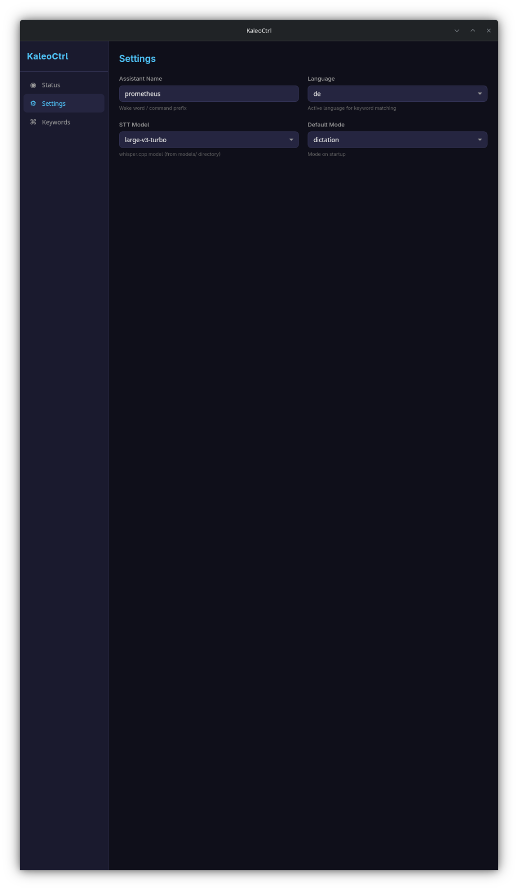
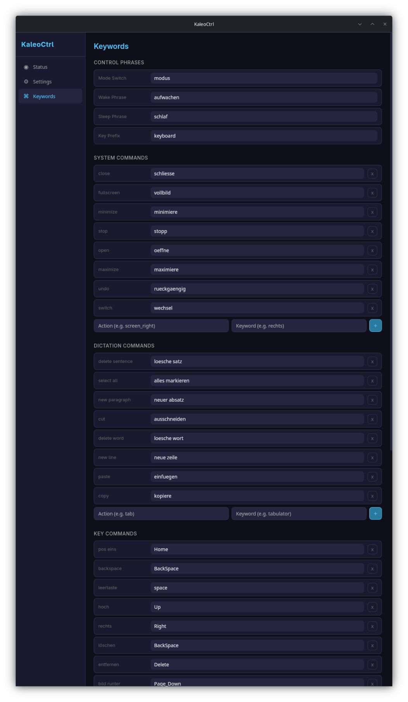
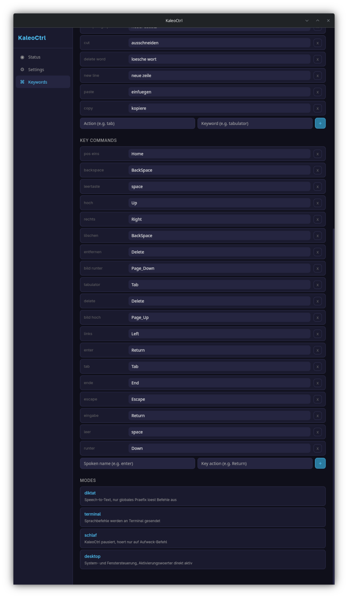
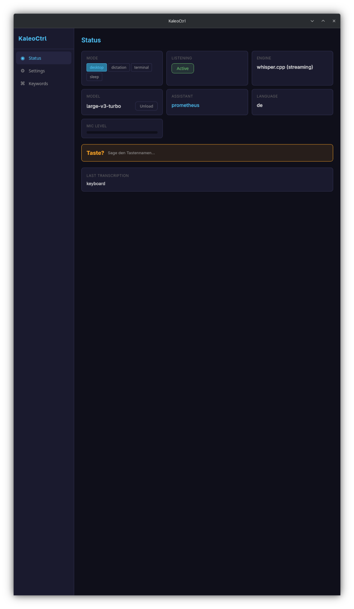
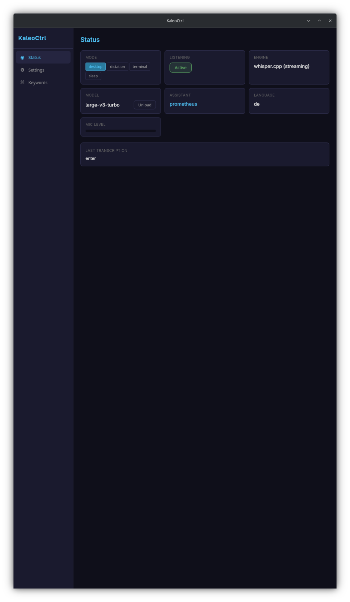

<p align="center">
  
</p>

<h1 align="center">KaleoCtrl</h1>

<p align="center">
  <b>Voice control and speech-to-text for the Linux desktop.</b><br>
  Speak to type. Speak to command. Fully offline. Fully private.
</p>

<p align="center">
  
  
  
  
  
  
</p>

<p align="center">
  <a href="https://ko-fi.com/maik0000ff"></a>
</p>

> **Early Development** — This project is in an early stage. Features may change, break, or be incomplete. Contributions and feedback are welcome.

---

## What is KaleoCtrl?

KaleoCtrl turns your voice into actions on the Linux desktop. It captures speech through your microphone, converts it to text using a local whisper.cpp model, and either **types the text** into any active application or **executes system commands** — all without sending a single byte to the cloud.

### Key Principles

- **100% offline** — all audio processing happens locally on your machine
- **Privacy-first** — no cloud, no telemetry, no data leaves your system
- **Hardware-flexible** — GPU acceleration via CUDA, Vulkan, Metal, or SYCL; runs on CPU too
- **Multilingual** — supports 99+ languages out of the box (whisper large-v3-turbo)
- **Extensible** — add new languages by dropping a keyword file, swap STT models via config

---

## Development Setup & Hardware

KaleoCtrl is being developed and tested on the following system:

| Component | Specification |
|-----------|--------------|
| **OS** | EndeavourOS (Arch-based) — Kernel 6.19 |
| **CPU** | Intel Core i9-13900H (20 threads) |
| **RAM** | 64 GB DDR5 |
| **GPU** | Intel Iris Xe Graphics (RPL-P) — integrated |
| **Display Server** | Wayland (KDE Plasma) |

### Whisper on Intel GPU

KaleoCtrl runs whisper.cpp with **Vulkan** backend to leverage the Intel Iris Xe integrated GPU for inference. This means no dedicated NVIDIA/AMD GPU is required — the model runs accelerated on the iGPU that's already in your laptop.

The setup:
- **whisper-rs** Rust bindings with `features = ["vulkan"]`
- **Mesa Vulkan driver** (`Intel open-source Mesa driver`) provides the GPU compute layer
- **Default model**: `large-v3-turbo` (809M params, GGML format) — best balance of accuracy and speed
- **Streaming mode**: audio is transcribed in real-time as you speak, not after you stop
- Inference runs at near real-time speed on the Iris Xe, with partial results delivered every ~1 second

**Limitation:** Real-time simultaneous speech-to-text is not achievable on this hardware. The Intel Iris Xe iGPU lacks the compute power for true simultaneous transcription — there is a noticeable delay between speaking and text output. For low-latency real-time STT, a dedicated GPU (e.g. NVIDIA with CUDA) is recommended.

Smaller models (`small`, quantized `q5_0`) are available for systems with less GPU memory or processing power and can reduce latency at the cost of accuracy.

---

## Screenshots

### Status Panel

<table>
<tr>
<td width="400">

</td>
<td valign="top">

**The main dashboard — real-time application state at a glance.**

- **Mode** — Switch between `desktop`, `dictation`, `terminal`, `sleep`
- **Listening** — Toggle microphone capture. Green "Active" when recording
- **Engine** — Currently loaded STT engine (whisper.cpp with streaming)
- **Model** — Load/unload the whisper model. Shows model name when loaded
- **Assistant** — Your custom wake word / command prefix (e.g. "prometheus")
- **Language** — Active language for keyword matching
- **Mic Level** — Real-time audio input level meter

All values update live. The status panel refreshes automatically every 2 seconds and reacts instantly to backend events.

</td>
</tr>
</table>

---

### Settings Panel

<table>
<tr>
<td width="400">

</td>
<td valign="top">

**Configure core application settings. All changes apply instantly — no save button, no restart.**

- **Assistant Name** — The wake word that prefixes all voice commands (e.g. *"prometheus open firefox"*)
- **Language** — Active language for keyword recognition. Determines which keyword file is loaded
- **STT Model** — Select which whisper.cpp model to use. Smaller models run faster on weaker hardware
- **Default Mode** — The mode KaleoCtrl starts in after launch

A "Saved" indicator briefly appears after each change to confirm the setting was applied.

</td>
</tr>
</table>

---

### Keywords Panel — Commands & Dictation

<table>
<tr>
<td width="400">

</td>
<td valign="top">

**Define voice keywords that map to actions. Fully editable, per-language, auto-saved.**

- **Control Phrases** — Core phrases: `mode_switch` triggers mode changes, `wake_phrase` / `sleep_phrase` wake or sleep the assistant, `key_prefix` activates key command mode
- **System Commands** — Voice-to-action mappings for desktop control: open/close apps, switch windows, minimize, maximize, fullscreen, undo
- **Dictation Commands** — Text editing controls for dictation mode: new line, new paragraph, delete word/sentence, select all, copy, paste, cut

Each entry shows the internal action on the left and the spoken keyword on the right. Click **x** to remove, or use the input row at the bottom to add new mappings.

</td>
</tr>
</table>

---

### Keywords Panel — Key Commands & Modes

<table>
<tr>
<td width="400">

</td>
<td valign="top">

**Map spoken words to keyboard keys and view operating modes.**

- **Key Commands** — Say the `key_prefix` followed by a key name to press that key. Example: *"keyboard enter"* sends the Return key. Supports arrows, home/end, page up/down, tab, escape, delete, space, and more
- **Modes** — Read-only overview of the four operating modes with their descriptions

Key commands bridge the gap between voice and keyboard — any key that can be typed can be triggered by voice.

</td>
</tr>
</table>

---

### Key Command in Action — Waiting for Key Name

<table>
<tr>
<td width="400">

</td>
<td valign="top">

**The user said *"keyboard"* — KaleoCtrl is now waiting for a key name.**

1. The configured `key_prefix` (*"keyboard"*) was recognized
2. KaleoCtrl entered **key pending mode**
3. The orange **"Taste? Sage den Tastennamen..."** indicator appears (*"Key? Say the key name..."*)
4. Last transcription shows **"keyboard"**
5. Listening is **Active** (green), model is **loaded**, mode is **desktop**

The orange box pulses to clearly signal that the app is waiting for the next spoken word to be interpreted as a key press.

</td>
</tr>
</table>

---

### Key Command in Action — Key Executed

<table>
<tr>
<td width="400">

</td>
<td valign="top">

**The user said *"enter"* — the Return key was pressed.**

1. *"enter"* was spoken while in key pending mode
2. KaleoCtrl matched it to the `Return` key
3. The key press was injected into the active application
4. The orange indicator disappeared — back to normal mode
5. Last transcription shows **"enter"**

The entire flow — say *"keyboard"*, wait for prompt, say *"enter"* — takes under 2 seconds. Any mapped key can be triggered this way.

</td>
</tr>
</table>

---

## How It Works

### Architecture

```
Microphone → Audio Capture (cpal) → Voice Activity Detection
                                            ↓
                                   Streaming Transcriber
                                     (whisper.cpp FFI)
                                            ↓
                                    Speech Recognition
                                            ↓
                        ┌───────────────────┼───────────────────┐
                        ↓                   ↓                   ↓
                  Command Parser      Key Command         Text Injection
                  (open, close,     (keyboard + key)     (type into active
                   switch, etc.)                           application)
                        ↓                   ↓                   ↓
                  System Actions      Key Press Sim.      Text Output
                  (wmctrl, xdg)       (xdotool/wtype)    (wtype/xdotool)
```

### Speech Processing Pipeline

1. **Audio Capture** — continuous microphone input via CPAL at 16kHz
2. **Voice Activity Detection** — detects when you start and stop speaking
3. **Streaming Transcription** — partial results while you speak, final result on silence
4. **Command Routing** — text is checked against keywords before being typed:
   - Mode switch commands (`"<name> mode desktop"`)
   - Wake/sleep commands (`"<name> wake up"` / `"<name> sleep"`)
   - System commands (`"open firefox"`, `"close window"`)
   - Key commands (`"keyboard enter"`, `"keyboard tab"`)
   - Dictation commands (`"new line"`, `"delete word"`)
   - If no command matches → text is typed into the active application

### Operating Modes

| Mode | Behavior |
|------|----------|
| **Desktop** | System commands are active directly — say *"open firefox"* without any prefix |
| **Dictation** | Pure speech-to-text. Everything you say gets typed. Commands require the assistant name as prefix (e.g. *"prometheus open firefox"*) |
| **Terminal** | Voice commands are sent to the terminal |
| **Sleep** | KaleoCtrl is paused. Only listens for the wake phrase |

Switch modes by saying: `"<assistant_name> mode <mode_name>"` — e.g. *"prometheus mode dictation"*

### The Assistant Name

You assign a custom name to your assistant (default: *"prometheus"*). This name acts as a **global command prefix** and works in every mode:

- In **desktop mode**: commands work with or without prefix
- In **dictation mode**: the prefix distinguishes commands from dictated text
- In **sleep mode**: only `"<name> wake up"` is recognized

This prevents false triggers — in dictation mode, saying *"open the file"* just types that text, while *"prometheus open firefox"* executes the command.

---

## Multilingual Support

KaleoCtrl supports any language that whisper.cpp can transcribe. Keywords are defined in per-language JSON files:

```
config/keywords_en.json    # English keywords
config/keywords_de.json    # German keywords
config/keywords_<lang>.json  # Add your own
```

To add a new language, create a keyword file following the same schema and select it in settings. The STT model (large-v3-turbo) supports 99+ languages natively.

---

## Tech Stack

| Component | Technology |
|-----------|-----------|
| Framework | Tauri v2 |
| Backend | Rust |
| Frontend | Svelte + CSS |
| STT Engine | whisper.cpp (via Rust FFI) |
| Default Model | whisper-large-v3-turbo (GGML, 809M params) |
| Audio Capture | CPAL |
| GPU Support | CUDA, Vulkan, Metal, SYCL |
| Config | JSON |

---

## Installation

### Quick Install (recommended)

The install script detects your distribution and handles everything:

```bash
git clone https://github.com/Maik-0000FF/KaleoCtrl.git
cd KaleoCtrl
chmod +x install.sh
./install.sh
```

The script offers three modes:
1. **Full install** — installs all dependencies, builds the app, and adds it to your application menu
2. **Dev setup** — installs dependencies only, for development with `cargo tauri dev`
3. **Build only** — skips dependency installation, just builds and installs

Supported distributions: **Arch/EndeavourOS/Manjaro**, **Ubuntu/Debian/Mint**, **Fedora/Nobara**, **openSUSE**

After installation, open **Settings > Model Manager** in the app to download a whisper model.

### Manual Build

If you prefer to install dependencies yourself:

```bash
npm install          # frontend dependencies
cargo tauri dev      # development mode (hot reload)
cargo tauri build    # production build
```

### Rust Checks

```bash
cargo check                  # type-check
cargo clippy                 # lint
cargo test                   # run tests
```

---

## Configuration

All config files live in `config/`:

### `config/settings.json`

```json
{
  "assistant_name": "prometheus",
  "language": "de",
  "stt_model": "large-v3-turbo",
  "default_mode": "dictation"
}
```

### `config/keywords_<lang>.json`

Contains per-language definitions for:
- Mode names and descriptions
- Control phrases (mode switch, wake/sleep, key prefix)
- System command keywords
- Dictation command keywords
- Key command mappings

---

## Planned Features

- [ ] Overlay window — compact floating status display
- [ ] Custom voice command scripting
- [ ] Application-specific keyword profiles
- [ ] Personal vocabulary — user-defined correction dictionary and custom terms that bias whisper recognition via `initial_prompt` and post-processing (not model fine-tuning)
- [ ] Plugin system for third-party integrations
- [ ] Wayland-native text injection improvements
- [ ] Audio device selection in GUI
- [ ] Pre-built release binaries (deb/rpm/AppImage) via GitHub Actions CI

---

## License

This project is licensed under the [PolyForm Noncommercial License 1.0.0](LICENSE).

You are free to use, modify, and share this software for any **noncommercial** purpose — personal use, research, education, hobby projects. Commercial use (including selling or embedding in commercial products) requires explicit permission from the author.
